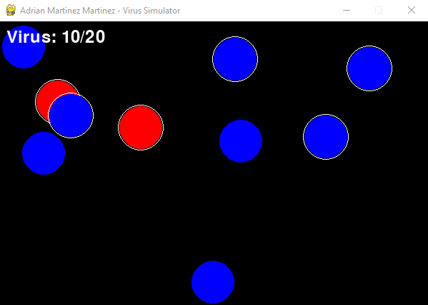

# Virus Simulator

Este proyecto es una simulación de virus utilizando **Pygame**, donde los virus (representados como círculos) se mueven aleatoriamente y se reproducen al colisionar, con un límite de 20 virus en pantalla.

## Características

- Simulación de movimiento aleatorio de virus.
- Reproducción por colisión entre virus.
- Control de reproducción con tiempos de espera.
- Máximo de 20 virus en pantalla.

## Demostración





## Requisitos

- **Pygame**: Puedes instalarlo con:

  ```bash
  pip install pygame
  ```

## Contacto

Para cualquier consulta o sugerencia, puedes contactar al desarrollador:

- **Nombre**: Adrian Martinez Martinez
- **Correo**: martinezmartinezaadrian@gmail.com
- **GitHub**: [ByTRAX78](https://github.com/ByTRAX78)